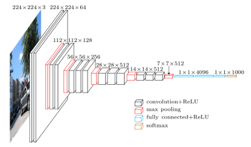

<h2> Plant-Disease-Detection-Using-VGG16 🍃</h2>
<h3>Table of Content</h3>
<ul>
<li><a href='#intro'>Introduction</a></li>
<li><a href='#cnn'>Understanding CNN?</a></li>
<li><a href='#vgg16'>Understanding transfer learning and VGG16</a></li>
<li><a href='#modelCreation'>Model creation and Evaluation</a></li>
<li><a href='#prediction'>Prediction</a></li>
<li><a href='#'>Conclusion</a></li>
</ul>

<h3 id='intro'>Introduction</h3>

Plant growth can be affected by many types of diseases which directly leads to effect the crop production and that affect the supply chain in food industry. We have a lot of option to decrease the plant dieseas but we need to take that option which is most efficient in both time and money.

With the help of deep learning technologies we can reduced the time of searching  which plant's leaves are diseased or healthy. It's a typical classification problem that can be solved using many of the deep learning algorithm such as DNN, CNN, or other machine learning algorithms.

In this project we are using CNN to classify which plant leaves are healthy and which one is not. Moreover we are using state of art transfer learning techniques such as VGG16 to get highly accurate model that precisiely classify the image.

<h3 id='cnn'>Understanding CNN</h3>

It stands for <i>Convolution Neural Network</i>, and it is the best algorithm when it comes to working with images, basically it takes two major mathematical opration that diffrentiate it with other Neural Network techniques.

<ol>
<li>Convolution Opration</li>
<li>Pooling Opration</li>
</ol>

1. <b>Convolution Opration</b>: Convolution is a specialized kind of linear operation. Convolution between two functions in mathematics produces a third function expressing how the shape of one function is modified by other.
<h4>Convolution Kernels</h4>
A kernel is a small 2D matrix whose contents are based upon the operations to be performed. A kernel maps on the input image by simple matrix multiplication and addition, the output obtained is of lower dimensions and therefore easier to work with.

<b>Fig:</b> Convolution opration

In this figure we found that our input matrix is of 6x6 and filter is of size 3x3 with <i>stride</i> = 1 and <i>padding</i> = 0, <b>*</b> represents convolution operation between Input matrix and the filter. This filter is basically used to detect the vertical edge in the image i.e. resultant matrix is basically used to reduced the image width and only take those part which is important.

<h4>Pooling Operation</h4>

Its function is to progressively reduce the spatial size of the representation to reduce the amount of parameters and computation in the network. We uses pooling to recognize an image, if the image is tilted or not same as previous image.

There are basically 2 types of pooling opraration:
<ol>
<li>Max Pooling</li>
<li>Average Pooling</li>
</ol>

<b>1. Max Pooling:</b>   

<b>Fig:</b> Max pooling Opration 

As the figure indicates if a 2x2 Max pool is used in the network then the  matrix creates a 2x2 window and takes the <i>maximum value amoung the 4 values</i> in that particular window. It's very important opration in CNN because it's bascally removes those low parameter values and reduces computation.

<b>2. Average pooling:</b> Average pooling is also doing similar opration but instead of taking maximum value from the window it calculates the average of the window and then gives the result. Basically today's in general we are using max pooling as the pooling layer opration because it gives better accuracy and also it's little faster than the average pooling opratin

With this two operation in CNN we can able to compute 2D inputs such as images very easily.

<h4>Complete CNN architecture</h4>

<b>Fig:</b> CNN Architecture

Let me explain the steps involved in this architecture

<ul>
<li>In first step an images is passed to Conv layer 1 which is used to do convolutin operation</li>
<li>Then pooling layer is created to reduced parameters</li>
<li>Layer 3 and 4 are similar like 1 and 2</li>
<li>In layer 5 which termed as hidden in this image also called flatten on fully connected layer are just a dense layer converted from the last conv layer after this layer only we apply <b>sigmoid or softmax</b> activation funtion to get the output.</li> </ul>

Let's now talk about VGG16 and transfer learning methodology

<h3 id='vgg16'>Understanding VGG16 architecture</h3>

VGG16 is a convolution neural net (CNN ) architecture which was used to win ILSVR(Imagenet) competition in 2014. It is considered to be one of the excellent vision model architecture till date. Most unique thing about VGG16 is that instead of having a large number of hyper-parameter they focused on having convolution layers of 3x3 filter with a stride 1 and always used same padding and maxpool layer of 2x2 filter of stride 2. It follows this arrangement of convolution and max pool layers consistently throughout the whole architecture. In the end it has 2 FC(fully connected layers) followed by a softmax for output. The 16 in VGG16 refers to it has 16 layers that have weights. This network is a pretty large network and it has about 138 million (approx) parameters.

<b>Fig:</b> VGG16 architecture

<h4>What is Transfer Learning?</h4>

Transfer learning is a machine learning method where a model developed for a task is reused as the starting point for a model on a second task. It is a popular approach in deep learning where pre-trained models are used as the starting point on computer vision and natural language processing tasks given the vast compute and time resources required to develop neural network models on these problems and from the huge jumps in skill that they provide on related problems. We are using the same approach for training our model. For this task we are basically following VGG16 architecure with pretrained model with imagenet.

<h3 id='modelCreation'>Model Creation</h3>
<h4>Working with data:</h4>
Before creating model for classifying data we required to work with data processing i.e <b>Collecting required data, feature engineering, data augmentation, etc</b>. So let's see that first.

<b>Collecting Data:</b> We basically take Kaggle's <a href='https://www.kaggle.com/vipoooool/new-plant-diseases-dataset'>New Plant Disease Dataset</a> that contain a set of healthy and diseased images in folders with name as their class. So we used keras flow_from_directory feature to collect different dataset.

During this we uses image_data_generator to augment image data in many ways. and reduces the image size by 255 point so that our computation get reduced
 After this we go for model creation.

Let's see the following

I have used VGG16 pretrained model as the image data is not big enough. As it shown in the image our VGG16 model takes more than 100M parameters which is quite large and good for getting good accuracy

After that I just go with flattening the layer and add one more dense layer to get the last output layer 

Then I train the model for basically 5 epochs and get arrount 92%  validation accuracy. Which is I think quite good.

Let's see the accuracy per epochs visually

Here Training accuracy and validation accuracy is quite same although it looks that our model get overfit but if we train the model for quite long it definetly reduced this overfitting condition

<h3 id='prediction'>Prediction</h3>

Let's see the following code:

  

<h3 id='conclusion'>Conclusion</h3>

So in conclusion we just say that the result is quite good using transfer learning algorithm but it can be better. So there are few things we can used to implement so that we can get better result.

<ul>
<li>First, we can take some other transfer learning techniques like ResNet50, AlexNet, Inceptin Model etc, also we can take more data to get better result.</li>
<li>We can also used different types of plants,to detect it accuratly.</li>
</ul>